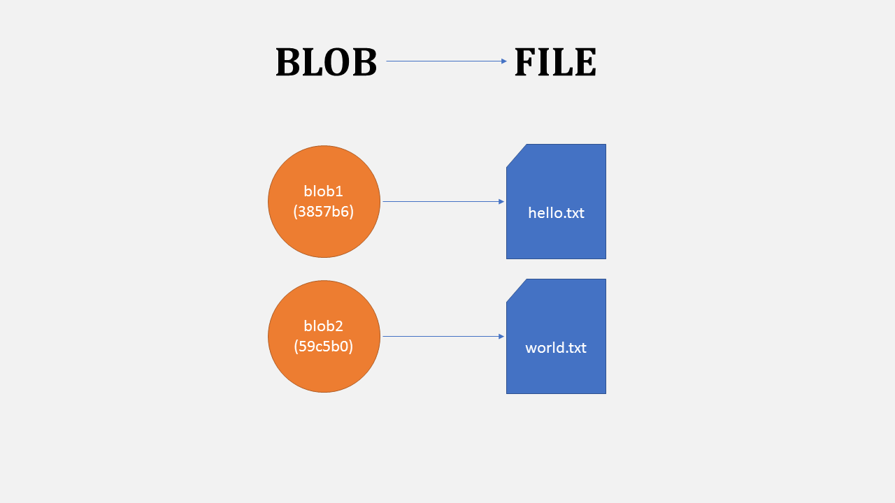
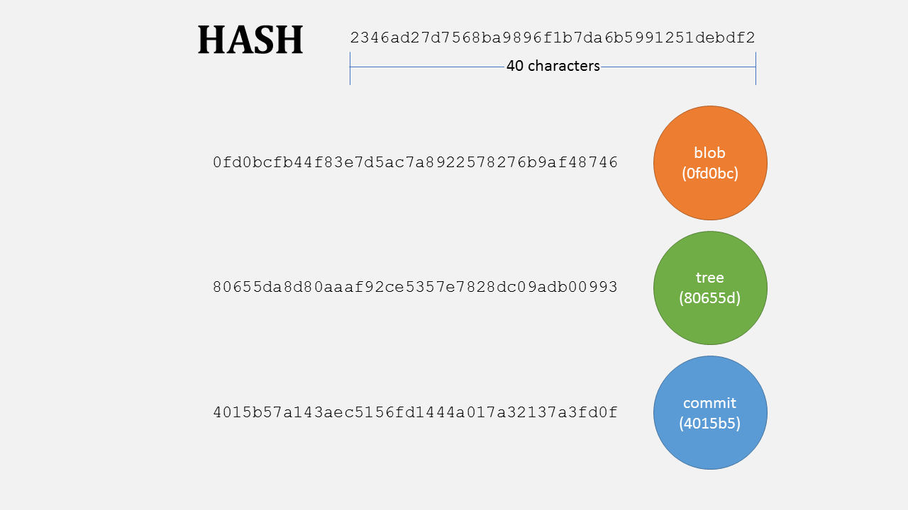
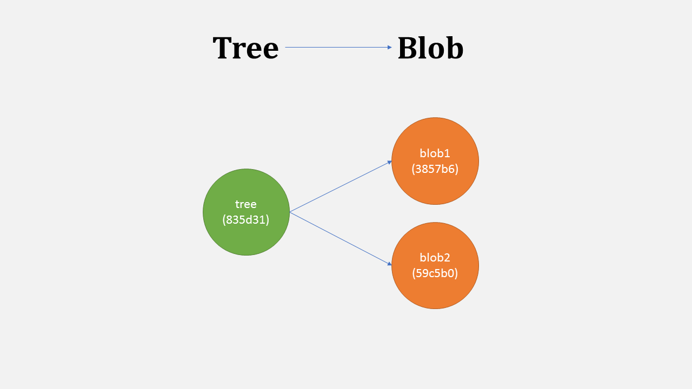
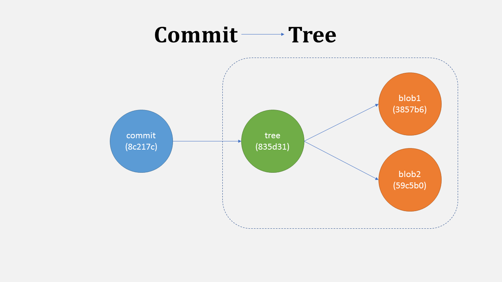
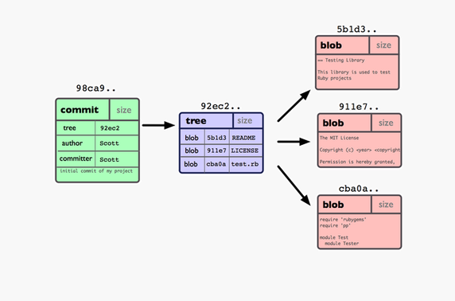

Long time ago I started hearing and reading about Git here and there and its various strange words like branch, index, tree, commit, clone, fork, master, origin, head, check out, check in, push and pull etc. Available tutorials were difficult to understand because they jumped straight to git commands. I asked this on [Quora](https://www.quora.com/How-do-you-explain-the-basics-of-Git-in-simple-words-What-does-branch-index-tree-commit-clone-fork-master-origin-head-check-out-check-in-etc-mean) in hope for something more visual and easier to understand, then answered it myself getting most upvotes. I am posting it with more and hopefully better explanation here on my own blog now :)

---

File OR Blob
------------

All contents of a file are stored in a thing called `blob`. When a file is changed, a new blob will store complete file with all new changes. Blob is one of the basic storage units in Git. Others units/object types are Commit and Tree.

Hash
----

`de9f2c7fd25e1b3afad3e85a0bd17d9b100db4b3`. You see a similar strange string or its short form with (first few characters) everywhere in git. This is `hash` ([SHA1](http://en.wikipedia.org/wiki/SHA1)). A hash can point to a blob, a commit or a tree. It is 40 characters but only few are usually enough to identify a commit. For example GitHub shows first 10 characters.

Tree
----

Files are stored in folders, and a folder can have many folders and files. Like files are always in some directory, a `tree` in git represent directories for blobs and other trees. 

There is always a tree on root, pointing to the tree wich contains stuff.

More details Git Object: tree | GitGuys.com
More details here http://www.gitguys.com/topics/git-object-tree/

Commit
------

Now let say you have two files. You want to save these in a way that you can get back to them in exact same state anytime later. When you save a snapshot of it with git, a `commit` is created pointing to the tree with two blobs (lets call them blob1 and blob2). Each commit has its own hash and it also saves your message, timestamp and your info.

When you change one file (blob1) and commit, git will store the complete file again in a new blob (blob1c). A new tree is created with a new hash pointing to blob2 and the new blob1c. Now your git repo has both versions of a file.

More Details:  
[Git Object: Git Commit - GitGuys]
(https://waybackmachine.org/web/20160902075749/http://www.gitguys.com/topics/git-object-commit/)

https://blog.thoughtram.io/git/2014/11/18/the-anatomy-of-a-git-commit.html

History
-------

If you make some changes and commit again, the next commit stores a pointer to the commit that came immediately before it. So the commits “flow” in one direction only. This flow of commits can be divide into multiple branches.
By default all commits go on master branch, but you can always create more branches. Commits are connect like a linked list where each new node points to previous node unlike simple link list. This gives us the power to create multiple nodes pointing to same previous commit. e.g. in above diagram 3rd and 4th commit both point to 2nd commit hence creating two branches.

Sources: 

http://gitready.com/beginner/2009/02/17/how-git-stores-your-data.html

https://jwiegley.github.io/git-from-the-bottom-up/1-Repository/3-blobs-are-stored-in-trees.html

https://blog.thoughtram.io/git/2014/11/18/the-anatomy-of-a-git-commit.html

